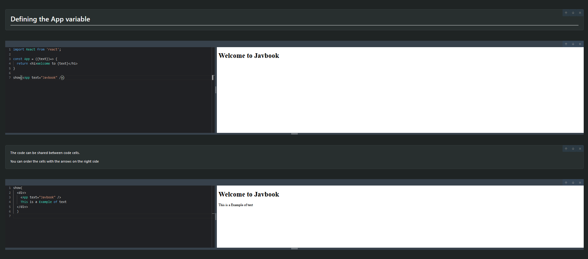

# JavBook

JavBook is a project of a virtual notebook that was developed for study, which had as its main objective to learn how the bundling process and implementation of online code editors like CodePen work, among others.

As its purpose was only for learning, this project will not have new features implemented and minor bugs will not be fixed.

## Technologies Used

    React: A JavaScript library for building user interfaces.
    Redux: A JavaScript library for managing application state.
    Typescript: A programming language that adds optional static typing to JavaScript.
    esbuild: An extremely fast and efficient build tool for JavaScript and TypeScript.
    Monaco Editor: A lightweight and powerful code editor used in web development environments.
    Vite:  Platform-agnostic frontend tool for building web applications quickly
    
## Main Features

    Real-time Editing and Execution: Write your JavaScript code directly in JavBook and see the results instantly.
    Markdown Support.
    Information Inside Code Cells can be used across every Code Cell.
    Can create, remove and order the cells

## Example

## How To Use

    To Use, you need to have NodeJS installed on your machine
    - Clone the repo in your machine
    - Run the command "npm i --legacy-peer-deps"
    - Run the command "npm run dev"